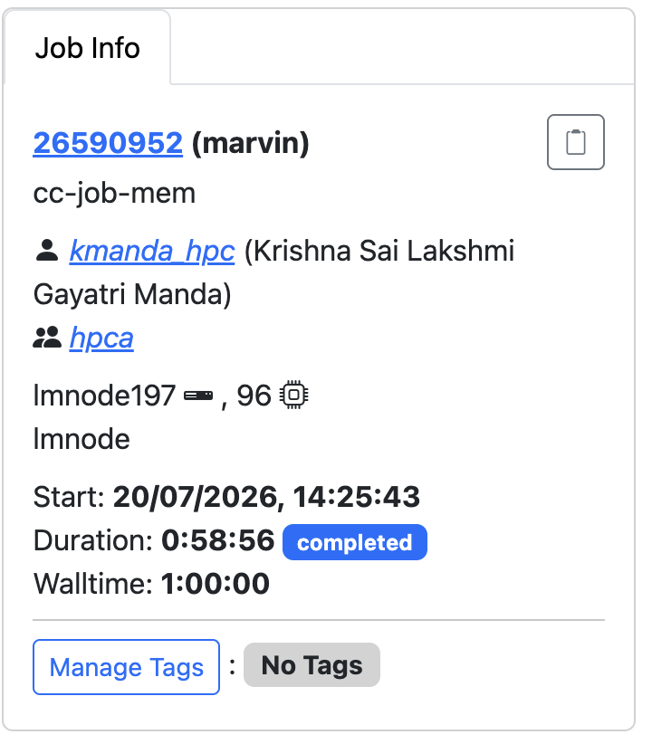
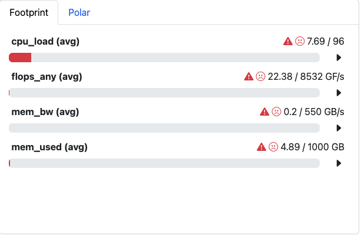
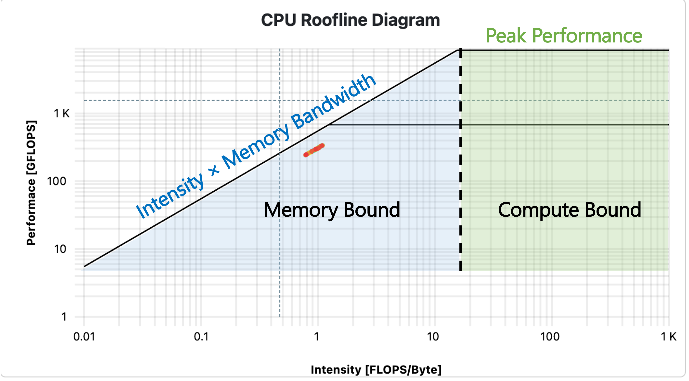
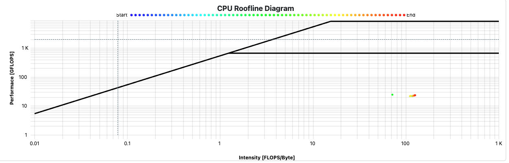
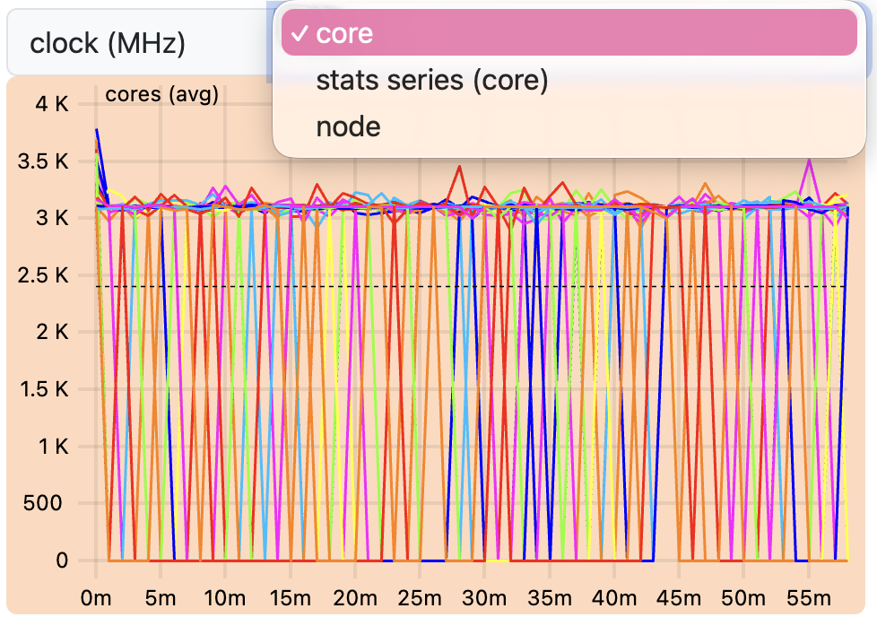
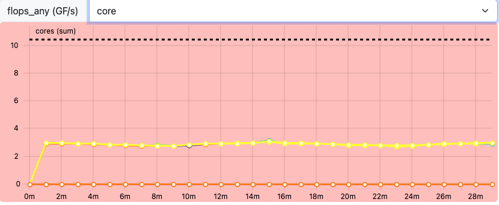
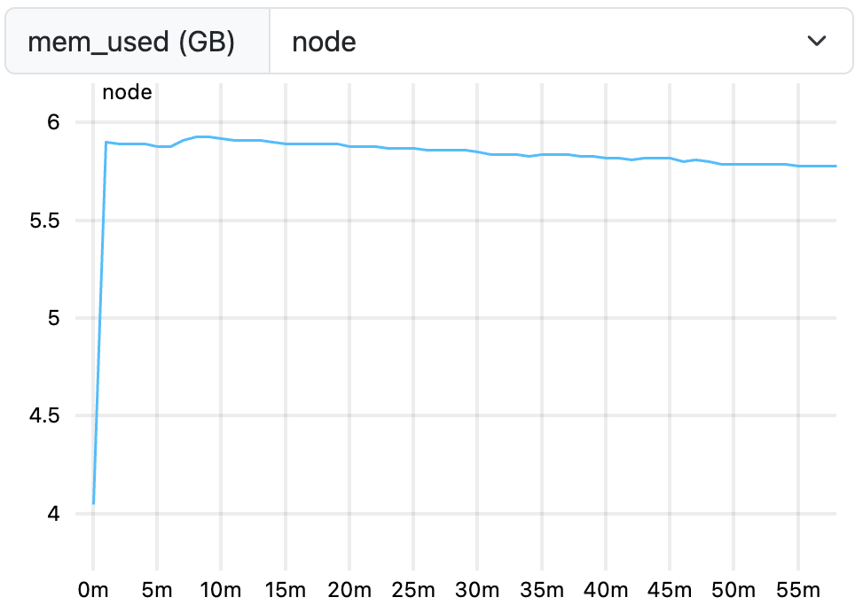
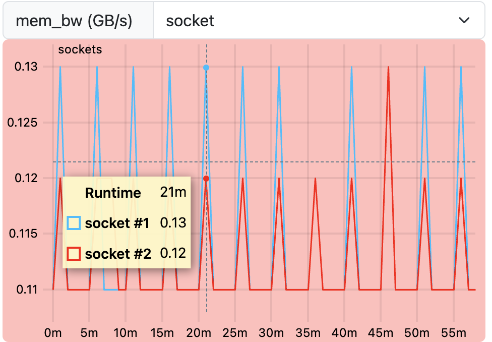
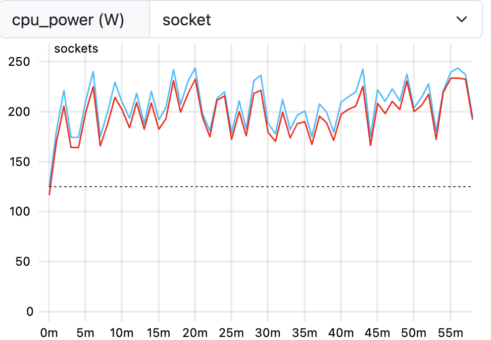

::: questions 
- Is job wall-time the only way to study job performance?
- What are commonly used metrics and perspectives on job performance?
:::

::: objectives
After completing this episode, participants should be able to …

- Create a comprehensive performance overview through dedicated tools.
- Explain the difference between sampling and tracing.
- Measure utilization and the impact of underlying hardware components.
:::


::: instructor
## Intention: Introduce third party tools for performance reports

Narrative:

- Scaling study, scheduler tools, project proposal is written and handed in
- Maybe I can squeeze out more from my current system by trying to understand better how it behaves
- Another colleague told us about performance measurement tools
- We are learning more about our application
- Aha, there IS room to optimize! Compile with vectorization


What we're doing here:

- Get a complete picture
- Introduce additional metrics / definitions, and popular representations of data, e.g. Roofline
- Relate to hardware on the same level of detail
:::


Wall-time measurements with `time` do not tell us why exactly an application is slower than expected.
To learn more about the *why*, we have to measure our applications behavior in more detail and capture the utilization of underlying hardware.
Broadly categorized, a jobs performance is mostly dependent on

- **CPU utilization**, e.g. how quickly instructions can be send to the processor, how quickly and how much data can be read from memory, and the raw calculation capabilities of the CPU.
- **Memory utilization** may vary in terms of how much data is stored in memory, how often data in memory is written or read, and how quickly the data can be read and written to.
- **Disk input and output** affects jobs that work with amounts of data that exceed available memory capacities.
- **Network input and output** affects applications that rely on remote data, e.g. MPI applications that regularly share results between processes on multiple worker nodes.


{alt='Diagram to visualize the data hierarchy of CPU architectures. Network, local disks, memory, and CPU caches have decreasing amounts of storage capacity, but increasing bandwidths and shorter latencies. Calculations occur in CPUs, possibly in multiple CPU cores, which may have multiple threads each, and even apply vectorized instructions.'}

::: discussion
# Want to share an example?

Every job is limited by a contention point in the hardware.
Resolving one issue, e.g. too slow reading of data from disk, just shifts the contention point to a different location, e.g. waiting for calculations to finish in the CPU cores.
The absolute performance of the application is improved, but it will be always "slowed down" somewhere.

Did you experience a situation, where an application was clearly slowed down in some way?
:::


## Measurement Workflows
To learn how applications utilize the computers hardware, we employ third party tools that read usage metrics from *performance counters*, often implemented either in the operating system kernels (software) or in hardware.

Dedicated performance measurement tools often employ similar methods and rely on the same sources of information, but they my focus on different issues and use different data processing and visualization methods.

In general there are two approaches to performance measurements:

1. **Sampling**: Read out performance counters and the application state at regular intervals during execution
1. **Tracing**: Record every event and operation that occurs

*Tracing* is exact and allows for a very detailed analysis.
On the other hand, it results in very large amounts of measurement data that even affects the applications performance during data collection.
It may be impractical in some situations.

*Sampling* on the other hand is less exact and results in a statistical description of the applications behavior.
Sampling has a smaller *measurement overhead*, but may suffer from, for example, slight mis-attributions of measurements to wrong sections of the code and fluctuating results between repeated measurements.

Measurement results are either stored and analysed in a *timeline*, or aggregated into a final measurement, often called a *profile*.


::: instructor
## Pick and prepare your tool!

We move on with three alternatives here.

1. *ClusterCockpit* is a job monitoring systems that can be configured to capture many performance metrics. It is easy to use, but has to be deployed by the cluster administration team.
1. *Linaro Forge Performance Reports* provides a good first performance overview, but is a commercial application that requires access to valid licenses.
1. *TBD* is a set of open source tools to create a performance overview independent of centralized services and licenses.

Pick one tool and stick to it throughout the rest of the course.
Consider mentioning alternatives and that learners may not have access to certain tools on every cluster, e.g. missing licenses for Linaro Forge.

Be aware of site-specific setups, e.g. limiting access to performance counters, offering non-standard Slurm options during `sbatch` submission, and how licenses are handled.
:::


::: callout
## Pick your tool!
For the following episodes, you can choose between three alternative perspectives on our jobs.
Choose one tool and stick to it for the rest of the course. The alternatives are:

1. [*ClusterCockpit*](https://clustercockpit.org/): A job monitoring service available on many clusters in NRW. Sampled measurements of the application are stored and visualized in a timeline for each job. It needs to be centrally provided by your HPC administration team and may not be available to you!
2. [*Linaro Forge Performance Reports*](https://docs.linaroforge.com/25.0.4/html/forge/performance_reports/index.html): A commercial sampling-based profiler providing a single page performance overview of your job. Access to licenses required.
3. *TBD*: A free, open source tool/set of tools, to get a general performance overview of your job.

These tools may require access to performance counters, sometimes granted by requesting `--exclusive`, but it really depends on the system.
Look at your cluster documentation or talk to your HPC support staff.
:::

::: instructor
## TODO: Discuss requirements in more detail?
```
cap_perfmon,cap_sys_ptrace,cap_syslog=ep
kernel.perf_event_paranoid
```
:::

Let us set up our performance measurement tool by running an example job with 8 cores.
To give the job enough work to be worth measuring, let's go with $2263 \times 2263$ pixels and `-spp=512`.

::: group-tab
### ClusterCockpit


For ClusterCockpit specifically, we repeat this experiment 4–5 times back to back.

A single run finishes quickly and would only give ClusterCockpit a handful of samples to plot, making the timelines look sparse and harder to read. Running it 4–5 times stretches the job out to roughly an hour, giving the sampling-based collectors enough time to gather a richer set of data points — which makes for much clearer plots when we look at the metrics.

We also request the node exclusively with `--exclusive` right away.
As you'll see in a moment, several of the metrics ClusterCockpit reports are not measured per core, but per socket or even per whole node — so any other job sharing the node would quietly bleed into our measurements. Running exclusively is the easiest way to keep the numbers trustworthy while we're still learning to read them.

1. Submit a job that runs for at least $5$ minutes, so it is picked up by cluster cockpit. The job script could look like this:

```bash
#!/usr/bin/bash
#SBATCH --time=01:00:00
#SBATCH --partition=lm_devel
#SBATCH --cpus-per-task=1
#SBATCH --ntasks=8
#SBATCH --nodes=1
#SBATCH --exclusive

module purge
module load GCC/13.2.0 OpenMPI/4.1.6-GCC-13.2.0 CMake/3.27.6-GCCcore-13.2.0 Boost/1.83.0-GCC-13.2.0 libpng/1.6.40-GCCcore-13.2.0

for i in {1..4}; do
        mpirun -n 8 ./build/raytracer -width=2263 -height=2263 -spp=512 -threads=1 -png "img_${SLURM_JOB_ID}_$(date +%Y-%m-%d_%H%M%S).png"
done
```
2. Log in to the ClusterCockpit web interface of your HPC system, as explained in your cluster documentation.
3. Go to `My Jobs` and click on the job with the same Slurm job id, once it is available

{alt='"My Jobs" tab in the ClusterCockpit web UI'}

### Performance Reports

1. Check your cluster documentation and/or module system if the Linaro Forge software suite is available
2. Submit a job loading the Linaro Forge module and start `mpirun` with the `perf-report` application:
```bash
#!/usr/bin/bash
#SBATCH --time=01:00:00
#SBATCH --ntasks=8
#SBATCH --nodes=1
#SBATCH --mem-per-cpu=1000MB

module load 2025 LinaroForge/25.1.1 GCC/13.2.0 OpenMPI/4.1.6 buildenv/default Boost/1.83.0 CMake/3.27.6 libpng/1.6.40

perf-report mpirun -- ./build/raytracer -width=2263 -height=2263 -spp=512 -threads=1 -png "$(date +%Y-%m-%d_%H%M%S).png"
```
3. Performance Report results are created as `.html` and `.txt` files next to the regular Slurm logs.

### TBD

N/A
:::


## General Report

As a first step, to go beyond a wall-time analysis, we employ the measurement tool to produce a general overview of our applications behavior.
Here, we typically try to answer questions like:

- Are available CPU, memory, disk, and network capabilities utilized well?
- Dose the jobs performance depend on a particular hardware component?
- Is there an obvious contention point that could be eliminated?

### First Overview

::: group-tab
### ClusterCockpit

The job view of a particular job in ClusterCockpit begins with three summary panels for the job.

{alt='ClusterCockpit Job Info panel'}

The *Job Info* panel summarizes Slurm metadata about the job, e.g. job ID, accounts, start time, duration, etc.

{alt='Cluster Cockpit Footprint panel summarizing central job characteristics'}

The *Footprint* panel summarizes a preconfigured set of performance characteristics for the job.
It categorizes values in a traffic-light system, so yellow and red indicators motivates further investigation.
The exact list and type of metrics depends on the ClusterCockpit configuration, which is prepared by the administrator of the service.

Here, all four values are not in acceptable range. We see why:

- `cpu_load (avg)` is shown in red. Since we requested the node with `--exclusive`, we were given all $96$ cores of the node, but our job only uses $8$ of them. The footprint compares load against the full $96$ cores that are requested by us, so it correctly flags that most of the requested resources are sitting idle — this is underutilization of requested resources.
- `flops_any (avg)` is Floating Point Operations per second. In this case, it is calculated as $22.84 GF/s$, which is far below what the node can theoretically achieve. We will look into why in the coming episodes — it can point to anything from not utilizing the hardware features  to simply not needing many floating point operations at all.
- `mem_used (avg)` shows the memory utilization of the job. This, together with the bandwidth metric below, is exactly why we requested an exclusive node in the first place: memory- and energy-related hardware counters are sensitive to granularity — they are measured at socket level or node level rather than per core — so running exclusively is what keeps them meaningful for our job alone. We go into this in more detail in the next section.
- `mem_bw (avg)` is the memory bandwidth, i.e. how much data is transferred to and from memory per second.

In general, this panel gives the most information on where the issue lies and where to start the investigation. In our case:
- We can utilize all $96$ cores instead of just $8$ to make use of the full exclusive allocation.
- We can improve either `flops_any` or `mem_bw`. To know which one actually makes sense to target, we need to look at the next panel — the Roofline plot.

**How to read a Roofline Plot**

Before looking at our job's result, here's what's actually what to expect on Roofline plot and how to understand the plot. Here is the example Roofline Plot:

{alt='Example Roofline plot with labels'}

In jobs performing floating point operations on data read from memory, i.e. any numeric operation, which are very common in HPC, a Roofline plot is a common visualization of the jobs performance.

- The x-axis is operational intensity — how many floating point operations are performed per byte loaded from memory. The y-axis is achieved performance — floating point operations per second.
- A diagonal line marks the maximum performance possible. $$P_{peak} = \min(\text{Memory Bandwidth} \times \text{Operational Intensity},\ \text{Flop/s}_{peak})$$
- A job with low intensity i.e. high memory transfers is pinned close to diagonal line — memory is the bottleneck, no matter how fast the CPU could otherwise compute.
- The two  horizontal lines mark the maximum performance possible if CPU computation itself is the limit — lower line for scalar operations, a higher one once vectorized instructions are used.
- Where the diagonal and horizontal lines meet is the knee. Left of the knee = memory bound (data movement is the bottleneck). Right of the knee = compute bound (calculation capability is the bottleneck).
- The colored dots show measurements taken at different points in time during the job's run, following a blue-to-red gradient: blue marks the start of the application, red marks the end. Their position relative to the rooflines shows how close each phase of execution came to the physical performance limits, and how that changed over the runtime.

:::::: discussion

Below is the Roofline plot for our application.
{alt='Cluster Cockpit Roofline plot of a job'}

Take a moment to look at where our raytracer's dot(s) land on the plot.

- Is the job **compute bound or memory bound**? Which side of the knee do the measurements fall on?
- Do the dots sit close to the scalar roofline, or closer to the vectorized roofline? What does that tell you about whether the application is actually using vectorized instructions?
- Given where the job sits, which metric is more interesting for our next investigation — `flops_any`, or `mem_bw`? Which one, if improved, would actually move the dot closer to a roofline?
- Does the dot's position stay roughly constant over the blue-to-red timeline, or does it drift? What might cause a job to move further from (or closer to) the roofline as it runs?

::::::

::::::::: callout

### Granularity of Metrics

Not every metric ClusterCockpit shows describes your job — some describe the whole CPU socket, or even the whole node, regardless of how many cores your job actually occupies. The underlying collectors read hardware performance counters that are simply wired up at a particular level of the machine, and they have no notion of which Slurm job is currently running. This is true regardless of which monitoring tool you use, but it is essential to understand for reading ClusterCockpit correctly.

Broadly, metrics come in three granularities:

- **Core-level**: measured separately for each individual CPU core, e.g. `cpu_user`, `ipc`, `flops_any`. These are meaningful for your job even if other jobs share the same node, since each core is attributed to exactly one job.
- **Socket-level**: measured once for an entire CPU socket (which may host several cores of several different jobs), e.g. `mem_bw` and the package power reading behind the Energy panel (`pkg_pwr`). If another job shares your socket, its memory traffic or power draw is mixed into your measurement.
- **Node-levl**: measured once for the whole compute node, e.g. `cpu_load`, `mem_used` and network or filesystem metrics. These are effected by every job on the node, not just yours.

Each metric plot in ClusterCockpit has a small drop-down menu as shown in image below, typically labelled core, socket, or node. This label tells you directly at which granularity that particular chart was measured — a core selection means one line per core of your job, while socket or node means the value is shared with (and possibly polluted by) other jobs. If the drop-down only offers socket or node, treat the value with more caution unless you know the node was exclusively yours

{alt='Drop down menu'}

This is precisely why we requested `--exclusive` when submitting our job earlier in this episode: on a node reserved exclusively for our job, socket- and node-level metrics describe our job alone, since there is nothing else running to mix into the measurement. If you cannot use `--exclusive`, for example because your allocation only ever needs a fraction of a node, keep an eye on which granularity a given metric is measured at, and treat socket- or node-level values as an upper bound that may include other jobs' activity rather than a precise reading of your own.


With that in mind, we dive into other metrics.

:::::::::

{alt='Select Metrics button in the ClusterCockpit job view'}

More detailed plots for each individual metric are available and can be configured through the *Select Metrics* button.


### Performance Reports
Linaro Forge `perf-report` results are stored in a HTML or `.txt` format, for example:

- [Linaro `perf-report` (HTML version)](data/raytracer_8p_1n_2025-12-16_09-53.html)
- [Linaro `perf-report` (txt version)](data/raytracer_8p_1n_2025-12-16_09-53.txt)

The text file is readable from the command line, which is very convenient for quick checks in HPC environments.
The HTML version, however, provides better rendered visualizations and formatting.

{alt='Linaro perf-report overview 1'}

At the top, the Performance Report states metadata about the underlying computer hardware and the application.
The job is summarized in terms of computational intensity, time spent in MPI calls, and impact of disk I/O operations.

The application is automatically classified in these three dimensions and accompanied with suggestions of further investigation.

Here, our application spends 99.5% of the runtime in computations.
Any performance optimization has to focus on improving calculations in the CPU.

### TBD

N/A
:::

### CPU

CPU performance can be categorized in

1. *Front-end* utilization: preparation and scheduling of instructions of program code provided through the cache hierarchy
2. *Computation*: Arithmetic and logical operations with various data types, including the utilization of vectorized instructions, etc.
3. *Back-end* utilization: loading and storing of data in the cache hierarchy

The front- and backend hardware of a physical CPU core is often duplicated to implement *simultaneous multithreading* (SMT, also called hyperthreading).
Here, the arithmetic logical unit receives data and instructions from two independent threads to achieve a sufficient amount, which is a common limiting factor in everyday calculations.
On HPC systems, the benefit of SMT is very much application-dependent.
It is often disabled on HPC systems, since code is optimized to maximize computational intensity.


::: group-tab
### ClusterCockpit
ClusterCockpit captures many dedicated CPU metrics and provides a timeline visualization for each.

{alt='ClusterCockpit cpu_user metric'}

`cpu_user` shows, per core, the share of CPU time spent executing our application's own instructions, as opposed to time spent in kernel/system activity or sitting idle.
A high `cpu_user` near $1$ is a good sign: the core is busy, and busy doing *our* work rather than system overhead.
A core with low `cpu_user` is worth a closer look — it suggests the core is occupied, by other activities like waiting on I/O which is not *our work*.

{alt='ClusterCockpit flops_any metric'}

`flops_any` captures any floating point operation on Intel CPUs, at core-level granularity, with single- and double-precision operations accumulated into the same value.
Recall from the Footprint panel that our job's `flops_any (avg)` sat at only $22.84$ GF/s, while the node's theoretical peak is $8532$ GF/s.
That gap looks enormous, but it isn't a fair comparison yet: the $8532$ GF/s peak is for all $96$ cores of the exclusive node, while our job only ever uses $8$ of them. Scaled down to $8$ cores, the theoretical peak is roughly $711$ GF/s — so $22.84$ GF/s is still well below what our $8$ cores could theoretically achieve, but nowhere near the dramatic 96-core gap the raw numbers first suggest.
This isn't a contradiction of the Roofline plot classifying the job as compute bound either way: compute bound only means the CPU's calculation capability is the limiting factor relative to how little data is moved, not that the job is issuing many *floating point* operations specifically.
Our raytracer performs plenty of integer, branching, and memory-addressing work per byte loaded — the kind of work `flops_any` doesn't count at all — which is why a low `flops_any` here isn't necessarily a red flag.

### Performance Reports
Performance Reports summarizes multiple CPU-related measurements.

{alt=''}

The raytracer spends 99.5% of its time in CPU-related operations.
This breaks down into scalar numeric operations (25.2%) and memory access (63.2%).
It recommends to study the memory access patterns and utilization of vectorized instructions as optimization approaches.

{alt=''}

The "Threads" section summarizes threading behavior for multithreaded applications.
A third of the time is spend in thread synchronization operations.

{alt=''}

In the "Thread Affinity" section, the applications association between individual threads and processes to specific CPU cores is visualized.
The 8 MPI processes of the example job should be explicitly mapped (pinned) to 8 cores of the job.
Here, the thread affinity is not measured correctly, due to a bug in the underlying software.

### TBD

N/A
:::


### Memory

Memory utilization is characterized in terms of used capacity, bandwidth and access latencies.

::: group-tab
### ClusterCockpit

{alt='ClusterCockpit mem_used metric'}

`mem_used` sits at approximately $5.8$ GB for our job, shown as an almost flat, straight line across the runtime — this is a good sign. A flat line means memory consumption is stable once the application has allocated what it needs.
A slanted, steadily increasing line instead would be a warning sign of a **memory leak**: memory that is allocated but never freed, growing continuously over the job's runtime instead of leveling off.


{alt='ClusterCockpit mem_bw metric'}

`mem_bw` is a **socket-level** metric — it measures how much memory is transferred to and from a given CPU socket per second, not per individual core.
Since our node has multiple sockets, you'll typically see a different `mem_bw` value reported for each socket. This difference depends entirely on which cores on each socket are actually active and running part of the application: a socket with more of our job's cores running on it will show higher memory traffic than a socket with fewer (or none) of them active.

### Performance Reports
{alt=''}

Performance Reports summarizes the memory utilization as a peak and mean measurement for all MPI processes.
Here, the results suggest a possible imbalance between MPI processes, since some have significantly more memory demand than others ($447$ vs. $212$ MiB on average)

If calculations depend directly on the amount of data in memory, then this correlates with unevenly busy MPI processes.

The memory usage over all is very small, so we may be committing too many resources to the amount of calculations in the job.

### TBD
N/A
:::

### Energy
::: group-tab
### ClusterCockpit
{alt=''}

`cpu_power` is another **socket-level** metric — it reports the power drawn by a CPU socket, not by an individual core.
Even when none of a socket's cores are actively running our application, the socket still draws a **baseline power**, since the hardware is powered on and idling rather than fully switched off.
As cores on a socket become active, power draw increases above that baseline — similarly to `mem_bw`, the exact increase depends on how many of that socket's cores are actually running part of our application. A socket with more active cores will show higher power draw than one with fewer (or none) active.

Depending on the ClusterCockpit configuration, an energy demand is displayed below the job info panels.
This measurement is highly dependent on hardware configurations of your HPC systems, so the estimates may vary.
They are often based on CPU package power measurements, which are unlikely to cover the whole energy demand of the node, e.g. omitting disks, fans, etc.
In other cases, the energy may be estimated from power supply measurements and scaled to CPU activity to get a more accurate estimate.

These estimates often still not include network, parallel filesystem components and cooling of the clusters.
Nevertheless, the estimate is a great tool to identify the scale of the jobs energy demand.

### Performance Reports
{alt=''}

In cases where Performance Reports has user access to energy counters of the operating system, it can also summarize the CPUs and systems energy expenditure.
Here, we are unfortunately missing the required access to the systems "RAPL" interface.

Your HPC system may have a way to enable access to energy counters, e.g. for exclusive jobs.
Consult your clusters documentation or support for more information.

### TBD
N/A
:::


### Miscellaneous
Typically, many more measurements and perspectives on the data are available for each tool.

::: group-tab
### ClusterCockpit
{alt=''}

ClusterCockpit provides a detailed statistics table to all measurements involved with a job.

### Performance Reports

{alt=''}
Performance Reports also summarizes the applications behavior in terms of MPI calls, e.g. time spent in collective calls involving all processors, or point-to-point communications.

In larger MPI applications, this can be of great help identify issues in MPI programming.
The example application has mostly independent MPI processes, where only initial data is scattered, and final results are gathered between processes.

{alt=''}
The I/O block summarizes measurements of interactions with the local file systems.
Here, no I/O operations are affecting the applications performance at all.

### TBD
N/A
:::


:::: challenge
## Exercise: Match application behavior to hardware

Which parts of the computer hardware may become a point of contention for these application patterns:

1. Calculating matrix multiplications
2. Reading data from processes on other computers
3. Calling many different functions from many equally likely if/else branches
4. Writing very large files (TB)
5. Comparing strings for matches
6. Constructing a large simulation model
7. Reading thousands of small files for each iteration

Maybe not the best questions, also missing something for accelerators.

::: solution
1. CPU (FLOPS), maybe the cache hierarchy if matrix elements do not align well to cache sizes
2. I/O (network)
3. CPU (Front-End), difficult to prepare instructions in time
4. I/O (disk), bandwidth limited
5. CPU (Back-End), getting strings through the caches
6. Memory (capacity)
7. I/O (disk)
:::
::::


## Summary
Dedicated performance measurement tools are helpful to create reports of the general job behavior.
These tools either trace every event, or sample the application and hardware state at regular intervals.
Many tools are available, but some may have to be set up by the HPC system administrators, or rely on valid licenses.

The relationship between a job and the execution on physical hardware can become a very deep topic.
One of these topics is the correct mapping of job processes to the requested number of CPU cores, addressed in the next episode.

::: keypoints
- Performance tools measure data as regular samples or by tracing every event
- The data is either processed and visualized in a timeline or aggregated in a final profile
- Job performance relates closely to contention points in physical hardware
  - CPU utilization (front-end, ALU, back-end), multithreading, vectorization
  - Memory utilization (capacity, bandwidth, latency)
  - Disk I/O
  - Network I/O

:::
